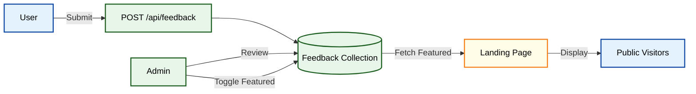
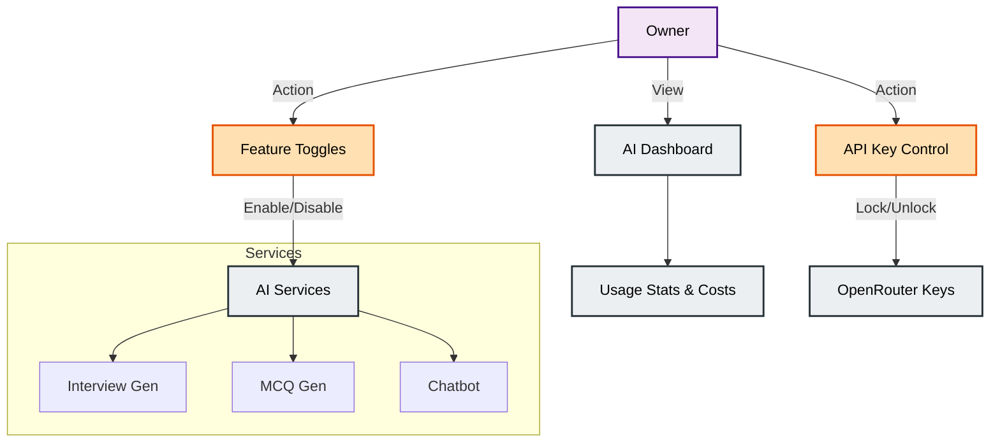
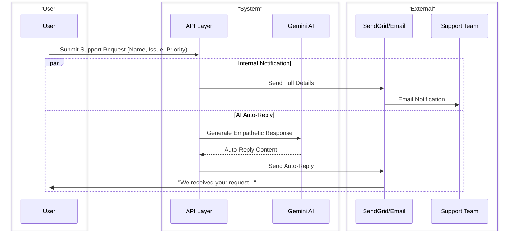
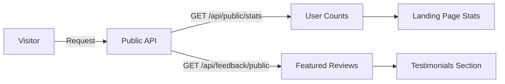

# 📘 InterviewAI 2.0 - System Workflow Notebook

This document provides a comprehensive overview of the InterviewAI 2.0 system workflows, features, constraints, and access permissions. It serves as a visual and descriptive guide to how different parts of the application interact and who controls them.

---

## 🔐 Access Control Matrix

The system defines three primary roles with hierarchical permissions: **User**, **Admin**, and **Owner**.

| Feature / Action | 👤 User | 🛡️ Admin | 👑 Owner | Constraints / Notes |
| :--- | :---: | :---: | :---: | :--- |
| **Authentication** |
| Register / Login | ✅ | ✅ | ✅ | Open to public |
| Verify Email | ✅ | ✅ | ✅ | Required for full access |
| 2FA | ✅ | ✅ | ✅ | Optional security layer |
| **Interview Prep** |
| Create Session | ✅ | ✅ | ✅ | |
| AI Generate Questions | ✅ | ✅ | ✅ | Rate limited |
| View Own Sessions | ✅ | ✅ | ✅ | |
| View Pending Sessions | ❌ | ✅ | ✅ | Global admin view |
| Delete Any Session | ❌ | ✅ | ✅ | Triggers notification to creator |
| **MCQ Tests** |
| Generate Test | ✅ | ✅ | ✅ | Adaptive difficulty |
| Take Test | ✅ | ✅ | ✅ | Fullscreen enforced |
| Manage Practice Tests | ❌ | ✅ | ✅ | Create/Edit/Delete static tests |
| **Content Management** |
| View Resources/Notes | ✅ | ✅ | ✅ | |
| Create Personal Notes | ✅ | ✅ | ✅ | |
| Manage Public Resources | ❌ | ✅ | ✅ | Delete any resource |
| **Feedback System** |
| Submit Feedback | ✅ | ✅ | ✅ | |
| Review/Feature Feedback| ❌ | ✅ | ✅ | Toggle "Featured" status |
| **User Management** |
| View All Users | ❌ | ✅ | ✅ | |
| Ban/Unban User | ❌ | ✅ | ✅ | Cannot ban self or superior roles |
| Delete User Account | ❌ | ✅ | ✅ | Soft delete + Session kill |
| Change User Role | ❌ | ❌ | ✅ | Exclusive Owner privilege |
| **System & Notifications** |
| AI Dashboard | ❌ | ✅ | ✅ | View Usage & Costs |
| AI Key Control | ❌ | ❌ | ✅ | Lock/Unlock specific provider keys |
| Feature Flags (Lock AI) | ❌ | ❌ | ✅ | Owner "Kill Switch" |
| Broadcast Notification | ❌ | ❌ | ✅ | Send to All or All Admins |

---

## 🔄 Core Workflows

### 1. 🔐 Authentication Flow

The entry point to the application, ensuring secure access via JWT and optional 2FA.

**Constraints:**
*   **Unique Email**: Duplicate emails are rejected during registration.
*   **OTP Expiry**: OTPs are valid for a limited time (e.g., 10 minutes).
*   **Banned Users**: Login is blocked if `isBanned` is true.

---

### 2. 🎤 Interview Preparation Workflow

The core feature allowing users to practice interviews with AI assistance.

**Permissions:**
*   **Users**: Can operate only on their own sessions.
*   **Admins**: Can view "Pending" requests from users who need guidance.
*   **Admins/Owners**: Can delete any session if it violates policies (triggers an email notification to the user).

---

### 3. 📝 MCQ Test System Workflow

Adaptive testing workflow with strict security monitoring.

**Constraints:**
*   **Fullscreen Enforcement**: Test auto-submits if user exits fullscreen too many times.
*   **Time Limit**: Strict server-side validation of submission time.
*   **Rate Limiting**: Users cannot generate unlimited tests rapidly to save AI costs.

---

### 4. 🛡️ User & Role Management (Admin/Owner)

The administrative workflow for managing user access and system integrity.

**Access Rules:**
*   **Hierarchy**: Admin cannot ban/delete another Admin or Owner.
*   **Owner Exclusivity**: Only Owner can touch `role` property (promote/demote).
*   **Self-Protection**: Users cannot ban or delete themselves via Admin APIs (must use "Request Deletion" flow).

---

### 5. 🤖 AI Chatbot Workflow

Context-aware assistance available globally.

**Permissions:**
*   **Access**: Available to all authenticated users.
*   **Locking**: controlled by `ai_chatbot` feature flag (Owner toggle).

---

### 6. 🔔 Notification System

Routing logic for system alerts.

**Constraints:**
*   **Broadcast**: Only **Owner** can initiate a "Broadcast" notification to all users.
*   **Preferences**: Users can opt-out of email notifications, but *not* system/security alerts inside the app.

---

## 🛠️ Feature Flags & System Constraints

The system includes a dynamic configuration layer stored in `SystemSettings` to manage feature availability.

| Feature Key | Description | Default | Controlled By |
| :--- | :--- | :--- | :--- |
| `ai_interview_generation` | Enable AI question generation | `true` | Owner |
| `ai_mcq_generation` | Enable AI test generation | `true` | Owner |
| `ai_chatbot` | Enable AI assistant | `true` | Owner |
| `code_execution` | Enable remote code runner | `true` | Owner |

**Workflow for Locking:**
1.  Owner toggles switch in Admin Dashboard.
2.  Backend updates `SystemSettings` collection.
3.  Feature middleware checks cache/DB on next request.
4.  If `false`, returns `503 Service Unavailable` with message.

---

### 7. 🗣️ Feedback & Review Workflow

Public-facing feedback system with administrative moderation.

**Features:**
*   **Public Access**: `/api/feedback/public` displays featured reviews.
*   **Moderation**: Admins can hide/show reviews and mark them as "Featured".
*   **Fallback**: If no featured reviews exist, system may show high-rated recent ones.

---

### 8. 🧠 AI System Management (Owner Only)

High-level control over AI costs and system integrity.

**Capabilities:**
*   **Dashboard**: View usage logs (`AIUsageLog`), token consumption, and system health.
*   **Key Management**: Force disable specific API keys if compromised or over-budget.
*   **Feature Flags**: detailed control over which AI modules are active.

---

### 9. 🆘 AI-Enhanced Support Workflow

Email-based support system with Gemini-powered auto-responses.

**Note**: The current system uses direct email processing. Support tickets are processed email and do not currently persist in a database for "Ticket Status" tracking in this version.

---

### 10. 🌍 Public Data Access

Endpoints available without authentication for landing pages and marketing.

**Scope:**
*   Strictly read-only access.
*   Limited to aggregated stats (Total Users) and curated content (Featured Feedback).
