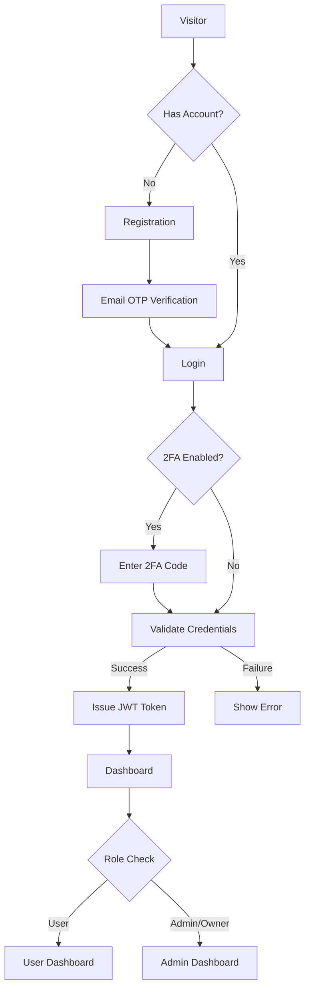
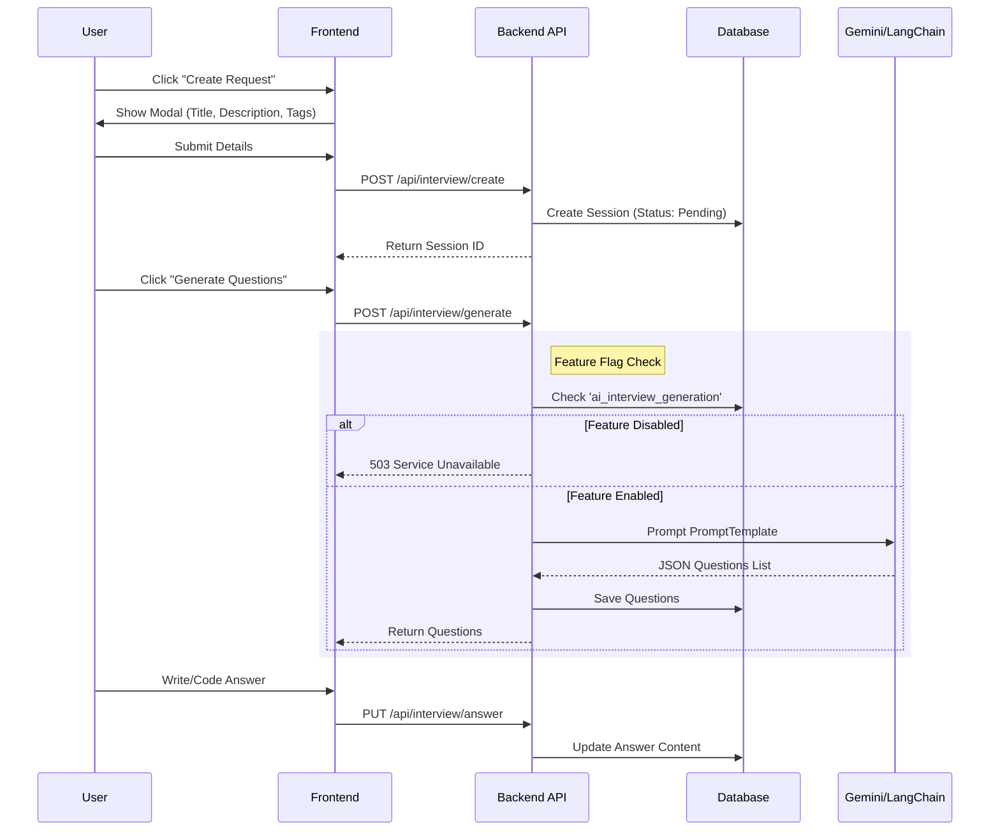
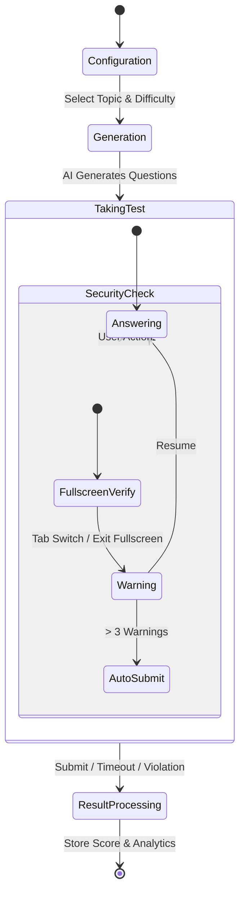
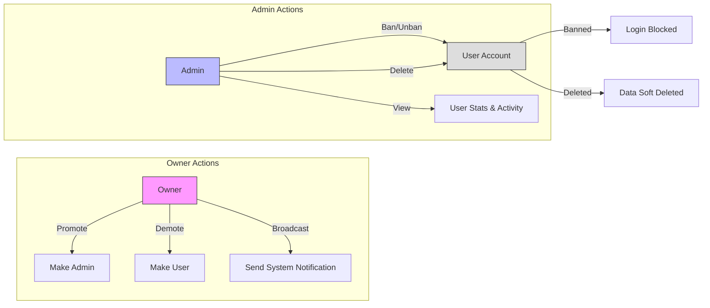
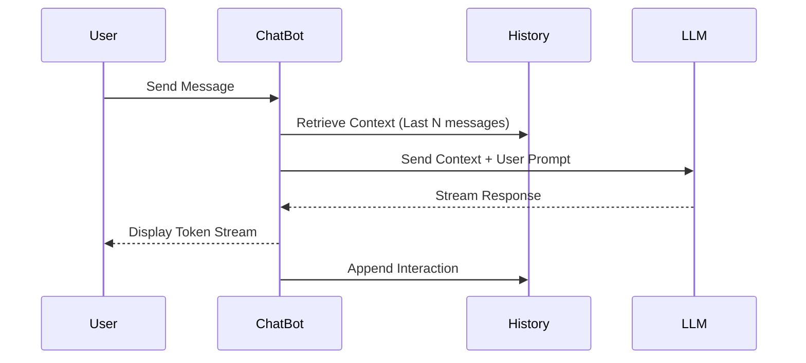
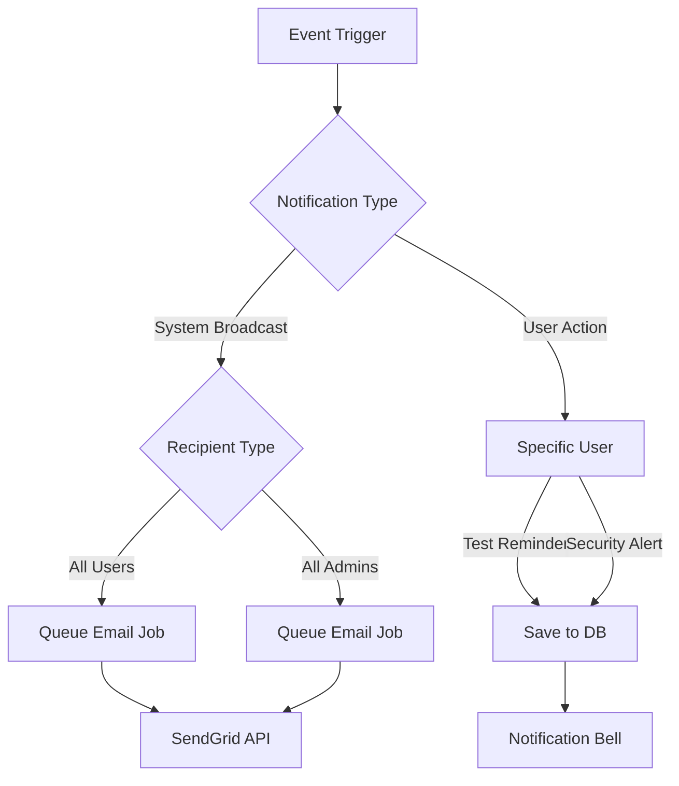

# üìò InterviewAI 2.0 - System Workflow Notebook

This document provides a comprehensive overview of the InterviewAI 2.0 system workflows, features, constraints, and access permissions. It serves as a visual and descriptive guide to how different parts of the application interact and who controls them.

---

## üîê Access Control Matrix

The system defines three primary roles with hierarchical permissions: **User**, **Admin**, and **Owner**.

| Feature / Action | 👤 User | 🛡️ Admin | 👑 Owner | Constraints / Notes |
| :--- | :---: | :---: | :---: | :--- |
| **Authentication** |
| Register / Login | ‚úÖ | ‚úÖ | ‚úÖ | Open to public |
| Verify Email | ‚úÖ | ‚úÖ | ‚úÖ | Required for full access |
| 2FA | ‚úÖ | ‚úÖ | ‚úÖ | Optional security layer |
| **Interview Prep** |
| Create Session | ‚úÖ | ‚úÖ | ‚úÖ | |
| AI Generate Questions | ‚úÖ | ‚úÖ | ‚úÖ | Rate limited |
| View Own Sessions | ‚úÖ | ‚úÖ | ‚úÖ | |
| View Pending Sessions | ‚ùå | ‚úÖ | ‚úÖ | Global admin view |
| Delete Any Session | ‚ùå | ‚úÖ | ‚úÖ | Triggers notification to creator |
| **MCQ Tests** |
| Generate Test | ‚úÖ | ‚úÖ | ‚úÖ | Adaptive difficulty |
| Take Test | ‚úÖ | ‚úÖ | ‚úÖ | Fullscreen enforced |
| Manage Practice Tests | ‚ùå | ‚úÖ | ‚úÖ | Create/Edit/Delete static tests |
| **Content Management** |
| View Resources/Notes | ‚úÖ | ‚úÖ | ‚úÖ | |
| Create Personal Notes | ‚úÖ | ‚úÖ | ‚úÖ | |
| Manage Public Resources | ‚ùå | ‚úÖ | ‚úÖ | Delete any resource |
| **User Management** |
| View All Users | ‚ùå | ‚úÖ | ‚úÖ | |
| Ban/Unban User | ‚ùå | ‚úÖ | ‚úÖ | Cannot ban self or superior roles |
| Delete User Account | ‚ùå | ‚úÖ | ‚úÖ | Soft delete + Session kill |
| Change User Role | ‚ùå | ‚ùå | ‚úÖ | Exclusive Owner privilege |
| **System & Notifications** |
| Feature Flags (Lock AI) | ‚ùå | ‚ùå | ‚úÖ | Owner "Kill Switch" |
| Broadcast Notification | ‚ùå | ‚ùå | ‚úÖ | Send to All or All Admins |

---

## 🔄 Core Workflows

### 1. üîê Authentication Flow

The entry point to the application, ensuring secure access via JWT and optional 2FA.

```mermaid
graph TD
    A[Visitor] --> B{Has Account?}
    B -- No --> C[Registration]
    C --> D[Email OTP Verification]
    D --> E[Login]
    B -- Yes --> E
    
    E --> F{2FA Enabled?}
    F -- Yes --> G[Enter 2FA Code]
    G --> H[Validate Credentials]
    F -- No --> H
    
    H -- Success --> I[Issue JWT Token]
    H -- Failure --> J[Show Error]
    
    I --> K[Dashboard]
    K --> L{Role Check}
    L -- User --> M[User Dashboard]
    L -- Admin/Owner --> N[Admin Dashboard]
```

**Constraints:**
*   **Unique Email**: Duplicate emails are rejected during registration.
*   **OTP Expiry**: OTPs are valid for a limited time (e.g., 10 minutes).
*   **Banned Users**: Login is blocked if `isBanned` is true.

---

### 2. 🎤 Interview Preparation Workflow

The core feature allowing users to practice interviews with AI assistance.

```mermaid
sequenceDiagram
    participant U as User
    participant FE as Frontend
    participant API as Backend API
    participant DB as Database
    participant AI as Gemini/LangChain
    
    U->>FE: Click "Create Request"
    FE->>U: Show Modal (Title, Description, Tags)
    U->>FE: Submit Details
    FE->>API: POST /api/interview/create
    API->>DB: Create Session (Status: Pending)
    API-->>FE: Return Session ID
    
    U->>FE: Click "Generate Questions"
    FE->>API: POST /api/interview/generate
    
    rect rgb(240, 240, 255)
        Note right of API: Feature Flag Check
        API->>DB: Check 'ai_interview_generation'
        alt Feature Disabled
            API-->>FE: 503 Service Unavailable
        else Feature Enabled
            API->>AI: Prompt PromptTemplate
            AI-->>API: JSON Questions List
            API->>DB: Save Questions
            API-->>FE: Return Questions
        end
    end

    U->>FE: Write/Code Answer
    FE->>API: PUT /api/interview/answer
    API->>DB: Update Answer Content
```

**Permissions:**
*   **Users**: Can operate only on their own sessions.
*   **Admins**: Can view "Pending" requests from users who need guidance.
*   **Admins/Owners**: Can delete any session if it violates policies (triggers an email notification to the user).

---

### 3. üìù MCQ Test System Workflow

Adaptive testing workflow with strict security monitoring.

```mermaid
stateDiagram-v2
    [*] --> Configuration
    Configuration --> Generation: Select Topic & Difficulty
    Generation --> TakingTest: AI Generates Questions
    
    state TakingTest {
        [*] --> Answering
        Answering --> SecurityCheck: User Action
        
        state SecurityCheck {
            [*] --> FullscreenVerify
            FullscreenVerify --> Warning: Tab Switch / Exit Fullscreen
            Warning --> AutoSubmit: > 3 Warnings
            Warning --> Answering: Resume
        }
    }
    
    TakingTest --> ResultProcessing: Submit / Timeout / Violation
    ResultProcessing --> [*]: Store Score & Analytics
```

**Constraints:**
*   **Fullscreen Enforcement**: Test auto-submits if user exits fullscreen too many times.
*   **Time Limit**: Strict server-side validation of submission time.
*   **Rate Limiting**: Users cannot generate unlimited tests rapidly to save AI costs.

---

### 4. 🛡️ User & Role Management (Admin/Owner)

The administrative workflow for managing user access and system integrity.

```mermaid
graph LR
    subgraph Owner Actions
        O[Owner] -->|Promote| A[Make Admin]
        O -->|Demote| U[Make User]
        O -->|Broadcast| N[Send System Notification]
    end
    
    subgraph Admin Actions
        AD[Admin] -->|Ban/Unban| B[User Account]
        AD -->|Delete| B
        AD -->|View| S[User Stats & Activity]
    end
    
    B -->|Banned| L[Login Blocked]
    B -->|Deleted| D[Data Soft Deleted]
    
    style O fill:#f9f,stroke:#333
    style AD fill:#bbf,stroke:#333
    style B fill:#ddd,stroke:#333
```

**Access Rules:**
*   **Hierarchy**: Admin cannot ban/delete another Admin or Owner.
*   **Owner Exclusivity**: Only Owner can touch `role` property (promote/demote).
*   **Self-Protection**: Users cannot ban or delete themselves via Admin APIs (must use "Request Deletion" flow).

---

### 5. 🤖 AI Chatbot Workflow

Context-aware assistance available globally.

```mermaid
sequenceDiagram
    participant User
    participant ChatBot
    participant History
    participant LLM
    
    User->>ChatBot: Send Message
    ChatBot->>History: Retrieve Context (Last N messages)
    ChatBot->>LLM: Send Context + User Prompt
    LLM-->>ChatBot: Stream Response
    ChatBot-->>User: Display Token Stream
    ChatBot->>History: Append Interaction
```

**Permissions:**
*   **Access**: Available to all authenticated users.
*   **Locking**: controlled by `ai_chatbot` feature flag (Owner toggle).

---

### 6. üîî Notification System

Routing logic for system alerts.

```mermaid
graph TD
    Trigger[Event Trigger] --> Type{Notification Type}
    
    Type -- System Broadcast --> Target{Recipient Type}
    Target -- All Users --> Q1[Queue Email Job]
    Target -- All Admins --> Q2[Queue Email Job]
    
    Type -- User Action --> Spec[Specific User]
    Spec -- Test Reminder --> DB[Save to DB]
    Spec -- Security Alert --> DB
    
    DB --> UI[Notification Bell]
    Q1 --> SEND[SendGrid API]
    Q2 --> SEND
```

**Constraints:**
*   **Broadcast**: Only **Owner** can initiate a "Broadcast" notification to all users.
*   **Preferences**: Users can opt-out of email notifications, but *not* system/security alerts inside the app.

---

## 🛠️ Feature Flags & System Constraints

The system includes a dynamic configuration layer stored in `SystemSettings` to manage feature availability.

| Feature Key | Description | Default | Controlled By |
| :--- | :--- | :--- | :--- |
| `ai_interview_generation` | Enable AI question generation | `true` | Owner |
| `ai_mcq_generation` | Enable AI test generation | `true` | Owner |
| `ai_chatbot` | Enable AI assistant | `true` | Owner |
| `code_execution` | Enable remote code runner | `true` | Owner |

**Workflow for Locking:**
1.  Owner toggles switch in Admin Dashboard.
2.  Backend updates `SystemSettings` collection.
3.  Feature middleware checks cache/DB on next request.
4.  If `false`, returns `503 Service Unavailable` with message.

---
